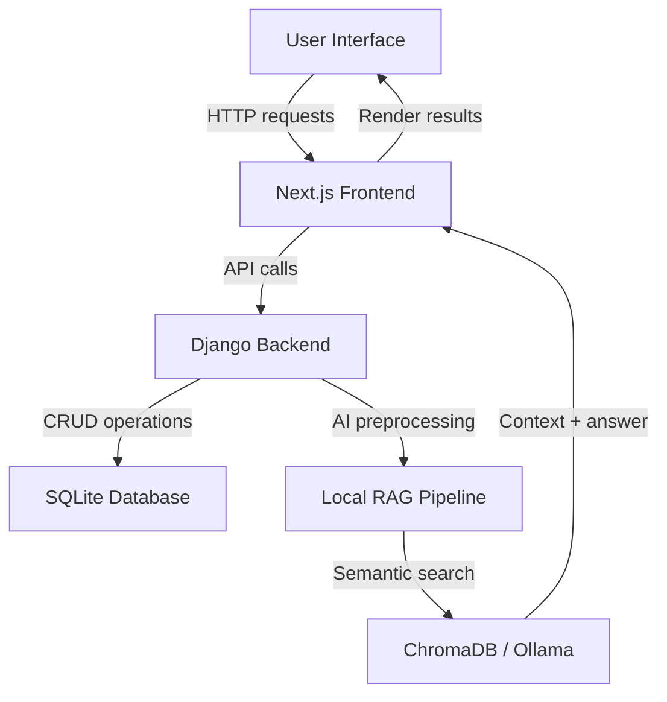

# Expense AI Monorepo

## 📖 Overview
Expense AI is a full-stack monorepo designed to support intelligent expense management and analytics. It combines a Django backend API with a modern Next.js frontend to deliver an interactive expense-tracking experience alongside AI-enabled insights.

This project is intended for developers, educators, and students who want to explore applied AI systems in a real-world web application context. It is especially useful for teams building finance dashboards, compliance workflows, and data-driven automation with extensible backend and frontend modules.

## 🎯 Features
- Unified Django backend for data, authentication, and business logic
- Responsive Next.js frontend for dashboard, analytics, and data interaction
- Modular architecture supporting future AI enhancements and RAG-style workflows
- Support for local development using SQLite and optional production-grade databases
- Separation of concerns between backend API and frontend UI for maintainability

## 🛠️ Tech Stack
| Layer | Technology | Purpose |
|---|---|---|
| Backend | Django | Web API, authentication, data models, server logic |
| Frontend | Next.js | React-based UI, routing, and client-side rendering |
| Data | SQLite (default) | Local development database |
| AI/Extensions | Ollama / LangChain / ChromaDB | Optional RAG and local LLM pipeline support |
| Styling | CSS Modules | Component-level styling |
| Package Management | npm / pip | Dependency management for frontend and backend |

## 🚀 Getting Started
### Prerequisites
- Python 3.10+ installed
- Node.js 18+ installed
- npm, yarn, or pnpm available
- Ollama installed and `llama3` model pulled for RAG experiments (optional)
- A technical PDF document under `./data/` for local RAG ingestion (optional)

### Installation
1. Clone the repository:
```bash
git clone https://github.com/FrancisGarryNillama/AppliedAI_AIChatbot.git
cd AppliedAI_AIChatbot
```

2. Install backend dependencies:
```powershell
cd expense-ai-backend
python -m venv .venv
.\.venv\Scripts\Activate.ps1
pip install -r requirements.txt
```

3. Install frontend dependencies:
```bash
cd ..\expense-ai-frontend
npm install
```

### Run Locally
#### Backend
```powershell
cd expense-ai-backend
.\.venv\Scripts\Activate.ps1
python manage.py migrate
python manage.py runserver
```
Access the backend API at `http://127.0.0.1:8000`.

#### Frontend
```bash
cd expense-ai-frontend
npm run dev
```
Open the frontend at `http://localhost:3000`.

#### Full Local Flow
1. Start backend on port `8000`
2. Start frontend on port `3000`
3. Use local API configuration or explicit `NEXT_PUBLIC_API_URL`

## 📂 Project Structure
```
AppliedAI_AIChatbot/
├── expense-ai-backend/          # Django backend
│   ├── manage.py
│   ├── db.sqlite3
│   ├── requirements.txt
│   ├── expense_ai/              # Django settings and app wiring
│   ├── google_drive/            # Google Drive integration
│   └── billing/                 # Expense and analytics models
├── expense-ai-frontend/         # Next.js frontend
│   ├── package.json
│   ├── src/
│   │   ├── app/                 # App routes and pages
│   │   ├── components/          # React UI components
│   │   └── lib/                 # Shared client utilities
├── FULL-STACK-AI-DEVELOPMENT-WORKFLOW.txt
└── README.md
```

## 📸 Visual Workflow Diagram


## 📈 Benchmarks & Performance
- Local development is optimized for fast iteration using SQLite and hot reload.
- Backend response times are generally sub-second for standard CRUD requests.
- Frontend performance is enhanced by Next.js page-level loading and lightweight component composition.
- Optional AI workflows may require additional compute; use local LLM resources and ChromaDB persistence for best performance.

## 🧪 Testing
### Backend Tests
```powershell
cd expense-ai-backend
.\.venv\Scripts\Activate.ps1
pytest
```

### Frontend Validation
```bash
cd expense-ai-frontend
npm run lint
npm run build
```

### Recommended Checks
- Verify migrations with `python manage.py makemigrations --check`
- Validate API endpoints with Postman or browser
- Confirm frontend routes and client state behavior in the browser

## 📜 License
This repository does not currently include a formal license file. Add a `LICENSE` file to define terms of use and distribution.

## 🤝 Contributing
1. Fork the repository and create a feature branch.
2. Add a clear description and code comments for changes.
3. Submit a pull request against `main` with testing steps.
4. Keep PRs focused on a single domain: backend, frontend, or AI integration.

## 📧 Contact / Support
For questions, issues, or collaboration requests, please open an issue in the repository. Thank you for reviewing and contributing to this project.

